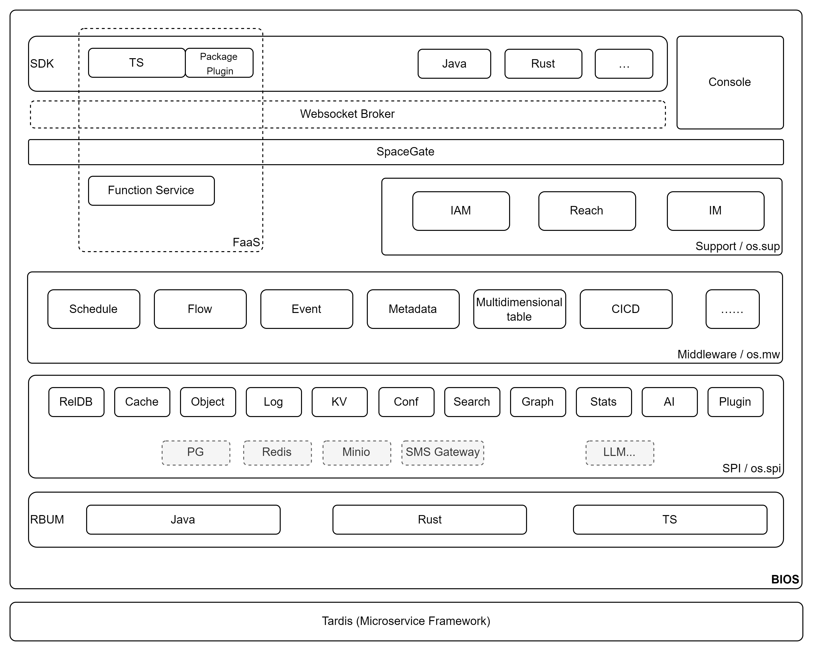

**WIP**

# BIOS(Business Informatization OS)业务信息化操作系统

[中文](README_CN.md)   [English](README.md)

> 对于计算机而言，``BIOS``(Basic Input/Output System)是操作系统加载和运行的基础，它抽象了硬件访问，是连接硬件和软件的关键纽带。
> 对于企业而言，我们也希望能够有一个类似的系统，为上层的业务应用提供基础的能力，并且抽象各主流云服务的接入，提供一致性的访问接口。

一言以蔽之：BIOS是一套**稳定**、**安全**、**轻量**、**可扩展**的技术平台，用于助力实现企业的数字化转型。

## 能力分层



``BIOS``绝大部分功能由``Rust``语言编写，依赖于由同一批贡献者维护的``Tardis``(https://github.com/ideal-world/tardis)框架。

``BIOS``从底层到上层分为**RBUM**、**SPI**、**Middleware**、**Support**、**FaaS**五个层次。

* **RBUM**(Resource-Based Unified Model)基于资源的统一模型。该模型为上层操作提供了``统一的基础操作、统一的凭证管理、统一的访问控制``等能力。

* **SPI**(Service Provider Interface)，提供了常用的基础操作抽象，以适配主流的中间件/云服务。比如我们提供了``全文搜索``操作，它适配了``PostgreSql``与``ElasticSearch``并且可以再扩展其它的实现。

* **Middleware**，提供了一些常用的中间件。与``SPI``层不同，这些中间件并不考虑适配性，以此获得更大的灵活性与自由度，可用于构建一些特色能力。比如我们提供了``事件服务``，它基于``Websocket``协议，实现了前端与后端、后端与后端间的事件穿透。

* **Support**，用于提供一些复杂的领域服务。与``Middleware``层不同，这些支撑服务聚合了``SPI``、``Middleware``的能力，形成了更为复杂的面向业务的服务。

* **FaaS**，用于实现以简单的前端技术构建通用业务应用。

所有的这些层次都是可选的，它们是``类库``，并不包含可运行的``服务``。我们通过一个特殊的**聚合服务**层用于将不同的能力聚合成需要的服务。在实际使用中，我们可以选择需要的能力以构建出符合自己需求的定制化的服务。

在网关的选择上，我们默认支持自研的名为``SpaceGate``(https://github.com/ideal-world/spacegate)的网关，以更好的与``BIOS``整合。

## 目录结构

```
|-- backend
  |-- basic                 基础操作模块，包含了RBUM及SPI的公共逻辑
  |-- spi                   SPI层
  |-- middleware            Middleware层
  |-- support               Support层
  |-- faas                  FaaS层
  |-- services              聚合服务层
  |-- gateway               网关适配层
    |-- spacegate-plugins   SpaceGate网关的定制插件
|-- frontend
  |-- console               控制台前端 
  |-- sdks                  各类接口封装及操作客户端
|-- examples                使用示例
|-- docs                    文档
```